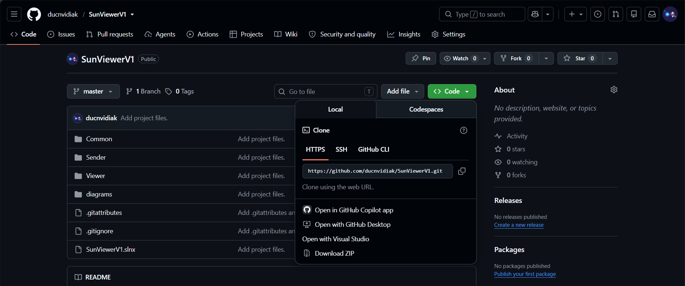
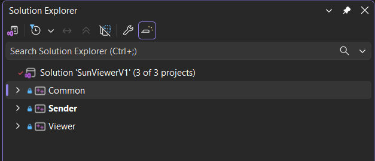
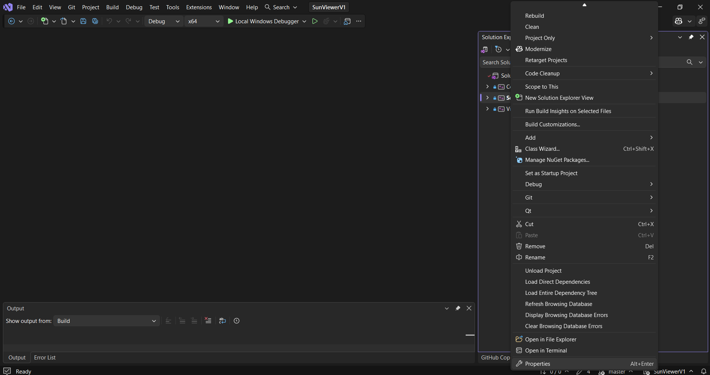
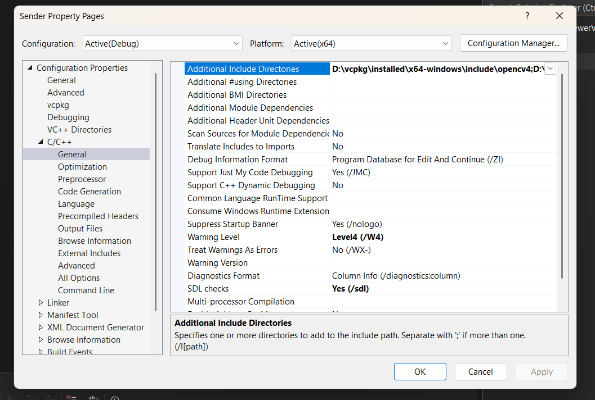
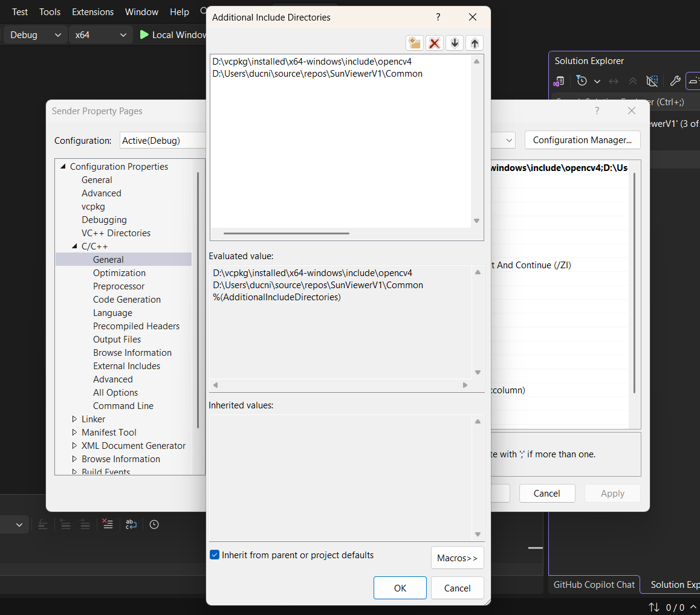
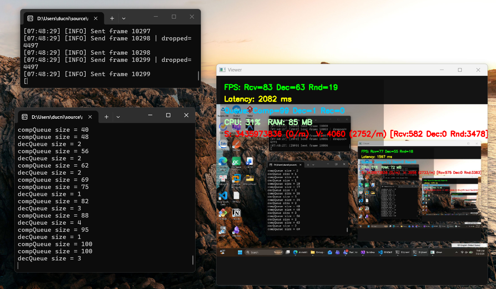

SunViewerV1
===============

Overview
--------
SunViewerV1 is a simple project that uses OpenCV and vcpkg. This README explains how to install dependencies, configure the project in Visual Studio 2022, and build/run the Viewer and Sender projects.

Installation
------------
1. Download the repository
   - Clone with Git:
	 git clone https://github.com/ducnvidiak/SunViewerV1.git
   - Or download ZIP from GitHub and extract to a folder.
   

2. Install vcpkg
   - Follow vcpkg instructions: https://github.com/microsoft/vcpkg
   - Example (Windows):
	 - Open PowerShell and run:
	   .\bootstrap-vcpkg.bat
	 - You can optionally run:
	   .\vcpkg integrate install

3. Install OpenCV via vcpkg
   - From the vcpkg root folder run (for 64-bit Windows):
	 .\vcpkg install opencv4:x64-windows
   - After installation, headers are available under:
	 <vcpkg_root>\installed\x64-windows\include\opencv4

4. Open the project in Visual Studio 2022
   - Launch Visual Studio 2022 and open the solution file SunViewerV1.sln in the repository root.
   

5. Configure Additional Include Directories
   - For both Viewer and Sender projects, open Project -> Properties -> Configuration Properties -> C/C++ -> General -> Additional Include Directories and add the following paths:
	 - <vcpkg_root>\installed\x64-windows\include\opencv4
	 - <repo_root>\SunViewerV1\Common
   - (You mentioned you will attach screenshots later; set these paths accordingly to your local vcpkg and repository locations.)
   
   
   
Build and Run
-------------
- In Visual Studio select the desired configuration (e.g., Debug, Release) and the x64 platform.
- Build the solution (Build -> Build Solution).
- After a successful build, the binaries are placed in:
  <repo_root>\SunViewerV1\x64\Debug
  In that folder you will find two executables:
  - Sender.exe — run this on the machine being controlled (the target/remote machine).
  - Viewer.exe — run this on the machine that controls/observes the target (the controller/local machine).
   
Notes
-----
- Ensure you use the x64 toolset / platform since vcpkg packages were installed for x64-windows.
- If Visual Studio does not automatically find vcpkg libraries, confirm vcpkg integrate install was run or set the vcpkg toolchain file in CMake settings (if using CMake).

Contact / Screenshots
---------------------
- If you will provide screenshots for Additional Include Directories, place them in the repository or attach them where appropriate.

